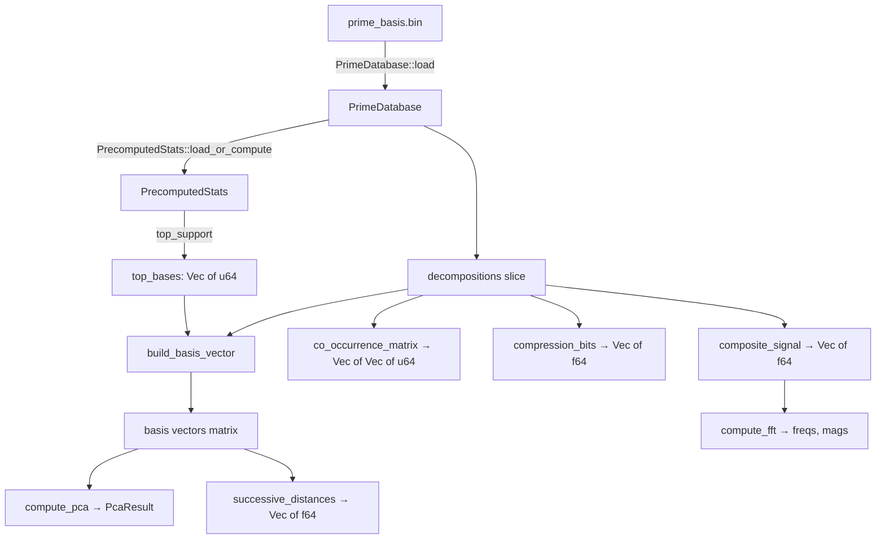

# Design Document: Phases 2–6 Visualizations

## Overview

This design covers 11 new visualization binaries and supporting analysis infrastructure for the Prime Basis Research tool. Each visualization is a standalone egui/eframe binary following the established pattern: load data via `viz_common::load_data()`, precompute plot data, run an interactive egui app. New computation logic lives in `src/analysis.rs` (extended) or a new `src/spectral.rs` module for FFT-related work. New dependencies: `rustfft` for FFT, `nalgebra` for PCA/linear algebra. 3D rendering for the Vector Walk uses egui's built-in painting (projected 3D → 2D) rather than a heavy 3D engine, keeping the dependency footprint small.

Implementation order: Phase Space → Modular Starfield → Resonance Cylinder → Compression Signature → Comb Spectrogram → Spectral Barcode → Successive Vector Distance → PCA → Hyper-Crystal Diffraction → 3D Vector Walk → Dependency Network.

## Architecture

All visualizations follow the same architecture established by Phase 1:

```
┌─────────────────────────────────────────────────┐
│                  Viz Binary                      │
│  (src/bin/viz_*.rs)                              │
│                                                  │
│  1. load_data() → (PrimeDatabase, PrecomputedStats)│
│  2. Precompute plot-specific data                │
│  3. eframe::run_native(App)                      │
│     └─ App::update() renders egui UI + plots     │
└──────────┬──────────────────────┬────────────────┘
           │                      │
    ┌──────▼──────┐       ┌──────▼──────┐
    │ viz_common   │       │ analysis    │
    │ (load, fmt)  │       │ (compute)   │
    └─────────────┘       └─────────────┘
                                │
                          ┌─────▼─────┐
                          │ spectral  │
                          │ (FFT ops) │
                          └───────────┘
```

### Module Organization

- `src/analysis.rs` — Extended with: `build_basis_vector()`, `successive_distances()`, `compute_pca()`, `co_occurrence_matrix()`, `compression_bits()`
- `src/spectral.rs` — New module for FFT: `composite_signal()`, `compute_fft()`, `find_peaks()`
- `src/viz_common.rs` — Extended with: `polar_to_cartesian()`, `color_by_index()`, `project_3d()`
- `src/bin/viz_phase_space.rs` — Phase Space Plot
- `src/bin/viz_starfield.rs` — Modular Starfield
- `src/bin/viz_resonance.rs` — Resonance Cylinder
- `src/bin/viz_compression.rs` — Compression Signature
- `src/bin/viz_spectrogram.rs` — Comb Spectrogram
- `src/bin/viz_barcode.rs` — Spectral Barcode
- `src/bin/viz_vector_distance.rs` — Successive Vector Distance
- `src/bin/viz_pca.rs` — PCA Embedding
- `src/bin/viz_diffraction.rs` — Hyper-Crystal Diffraction
- `src/bin/viz_vector_walk.rs` — 3D Vector Walk
- `src/bin/viz_network.rs` — Dependency Network

### Dependency Additions (Cargo.toml)

```toml
rustfft = "6"
nalgebra = "0.33"
```

## Components and Interfaces

### Analysis Functions (src/analysis.rs extensions)

```rust
/// Build a binary basis vector for a decomposition over the top-K base primes.
/// Returns a Vec<f64> of length K where entry i is 1.0 if base_primes[i]
/// is in the decomposition's components, else 0.0.
pub fn build_basis_vector(
    decomp: &PrimeDecomposition,
    top_bases: &[u64],  // sorted list of top-K base primes
) -> Vec<f64>;

/// Compute Euclidean distances between consecutive basis vectors.
/// Returns a Vec<f64> of length (decompositions.len() - 1).
pub fn successive_distances(
    decompositions: &[PrimeDecomposition],
    top_bases: &[u64],
) -> Vec<f64>;

/// Compute PCA on a matrix of basis vectors.
/// Returns (eigenvalues, eigenvectors, mean_vector).
/// eigenvectors is a Vec of Vec<f64>, each eigenvector sorted by
/// descending eigenvalue. Only the top `n_components` are returned.
pub struct PcaResult {
    pub components: Vec<Vec<f64>>,      // n_components × K
    pub explained_variance: Vec<f64>,   // n_components eigenvalues
    pub explained_variance_ratio: Vec<f64>, // normalized
    pub mean: Vec<f64>,                 // K-dimensional mean
}

pub fn compute_pca(
    decompositions: &[PrimeDecomposition],
    top_bases: &[u64],
    n_components: usize,
) -> PcaResult;

/// Project a single basis vector onto the PCA components.
/// Returns a Vec<f64> of length n_components.
pub fn pca_project(
    basis_vector: &[f64],
    pca: &PcaResult,
) -> Vec<f64>;

/// Compute co-occurrence matrix for base prime pairs.
/// Returns a symmetric K×K matrix where entry (i,j) counts how many
/// decompositions contain both top_bases[i] and top_bases[j].
pub fn co_occurrence_matrix(
    decompositions: &[PrimeDecomposition],
    top_bases: &[u64],
) -> Vec<Vec<u64>>;

/// Compute per-decomposition bit cost.
/// bits = sum(ceil(log2(c+1)) for c in components) + ceil(log2(count+1))
pub fn compression_bits(decomp: &PrimeDecomposition) -> f64;
```

### Spectral Functions (src/spectral.rs — new module)

```rust
use rustfft::{FftPlanner, num_complex::Complex};

/// Map base primes to frequencies: freq(p) = p as f64 (natural frequency).
/// For each decomposition, sum sin(2π × freq(c) × t) for each component c,
/// where t = decomposition index / total.
pub fn composite_signal(
    decompositions: &[PrimeDecomposition],
    total: usize,
) -> Vec<f64>;

/// Compute FFT magnitude spectrum of a real signal.
/// Returns (frequencies, magnitudes) where frequencies are in [0, N/2].
pub fn compute_fft(signal: &[f64]) -> (Vec<f64>, Vec<f64>);

/// Find peaks in a magnitude spectrum exceeding mean + n_sigma * std_dev.
pub fn find_peaks(magnitudes: &[f64], n_sigma: f64) -> Vec<(usize, f64)>;
```

### Viz Common Extensions (src/viz_common.rs)

```rust
/// Convert polar (r, theta) to Cartesian (x, y).
pub fn polar_to_cartesian(r: f64, theta: f64) -> [f64; 2];

/// Map an index in [0, total) to a blue→red gradient color.
pub fn color_by_index(index: usize, total: usize) -> egui::Color32;

/// Project a 3D point to 2D using a simple rotation matrix.
/// yaw and pitch are in radians.
pub fn project_3d(point: [f64; 3], yaw: f64, pitch: f64, scale: f64) -> [f64; 2];
```

### Visualization Binary Designs

#### Phase Space Plot (`viz_phase_space.rs`)

App state:
- `points: Vec<[f64; 3]>` — (gap, num_components, next_gap) for all decompositions
- `color_by_index: bool` — toggle for temporal coloring
- `show_3d: bool` — toggle for 3D delay embedding view
- `yaw: f64, pitch: f64` — camera angles for 3D projection

Rendering:
- 2D mode: `egui_plot::Points` scatter of (gap, components), colored by component count or index
- 3D mode: project (gap, components, next_gap) via `project_3d()`, render as `egui_plot::Points`
- Downsampling: use `sampled_range()` when point count > 50,000

#### Modular Starfield (`viz_starfield.rs`)

App state:
- `modulus: u32` — current modulus (default 30)
- `primes_data: Vec<(u64, u64, usize, usize)>` — (prime, gap, num_components, index) for all
- Precomputed polar points recomputed on modulus change

Rendering:
- Convert to polar: r = index, θ = 2π × (prime mod M) / M
- Convert to Cartesian via `polar_to_cartesian()` for `egui_plot::Points`
- Point radius ∝ gap size (clamped to [1.0, 6.0])
- Color via `color_by_index()` based on component count mapped to temperature

UI: slider for modulus (2–500), preset buttons for 6, 30, 210

#### Resonance Cylinder (`viz_resonance.rs`)

App state:
- Same data as Starfield
- `modulus: f32` — animated, fractional for smooth interpolation
- `playing: bool`, `speed: f32`
- `frame_count: u64`

Rendering: same as Starfield but modulus auto-increments each frame when playing.

#### Compression Signature (`viz_compression.rs`)

App state:
- `decomp_bits: Vec<f64>` — per-decomposition bit cost (precomputed via `compression_bits()`)
- `log2_primes: Vec<f64>` — log₂(prime) for each decomposition
- `ratios: Vec<f64>` — decomp_bits / log2_prime
- Running averages of both series

Rendering:
- Top panel: line plot of decomp_bits and log₂(prime) vs index
- Bottom panel: line plot of ratio vs index with running average overlay
- Header: summary stats (avg ratio, min, max)

#### Comb Spectrogram (`viz_spectrogram.rs`)

App state:
- `top_bases: Vec<u64>` — top N base primes by support score
- `texture: egui::TextureHandle` — rendered image
- `scroll_offset: usize` — vertical scroll position
- `visible_rows: usize` — number of rows visible
- `n_bases: usize` — configurable column count

Rendering:
- Build an image buffer: width = n_bases, height = visible_rows
- Each pixel: bright if base prime is used in that decomposition, dark otherwise
- When zoomed out (visible range > pixel height), aggregate blocks: pixel intensity = usage fraction in block
- Render as egui texture, scroll via vertical drag/scroll

#### Spectral Barcode (`viz_barcode.rs`)

Same architecture as Comb Spectrogram but with inverted color scheme (dark = used, light = unused) and horizontal barcode orientation per row.

#### Successive Vector Distance (`viz_vector_distance.rs`)

App state:
- `distances: Vec<f64>` — precomputed via `successive_distances()`
- `running_avg: Vec<[f64; 2]>` — running average via `running_average()`

Rendering:
- Line plot: index vs distance
- Overlay: running average line
- Header: mean, std dev, trend

#### PCA Embedding (`viz_pca.rs`)

App state:
- `pca: PcaResult` — precomputed
- `projected: Vec<[f64; 3]>` — all points projected to first 3 PCs
- `axis_pair: (usize, usize)` — which PCs to display (default (0,1))

Rendering:
- Scatter plot of selected PC pair
- Color by prime index
- Dropdown/buttons to switch axis pair: PC1vPC2, PC1vPC3, PC2vPC3
- Display explained variance ratios

#### Hyper-Crystal Diffraction (`viz_diffraction.rs`)

App state:
- `signal: Vec<f64>` — composite signal from `composite_signal()`
- `fft_freqs: Vec<f64>`, `fft_mags: Vec<f64>` — from `compute_fft()`
- `peaks: Vec<(usize, f64)>` — from `find_peaks()`

Rendering:
- Top panel: composite signal amplitude vs prime index (downsampled line plot)
- Bottom panel: FFT magnitude spectrum with peak markers

#### 3D Vector Walk (`viz_vector_walk.rs`)

App state:
- `trajectory: Vec<[f64; 3]>` — cumulative sum of displacement vectors
- `axis_bases: [u64; 3]` — which base primes map to X, Y, Z (default [1, 2, 3])
- `yaw: f64, pitch: f64, zoom: f64` — camera state
- `dragging: bool`

Rendering:
- Project 3D trajectory to 2D via `project_3d()`
- Render as connected line segments with color gradient by index
- Mouse drag rotates (yaw/pitch), scroll zooms
- Downsample to 20,000 segments max

#### Dependency Network (`viz_network.rs`)

App state:
- `nodes: Vec<NetworkNode>` — base primes with position, velocity, support score
- `edges: Vec<(usize, usize, u64)>` — (node_i, node_j, co-occurrence count)
- `co_occurrence: Vec<Vec<u64>>` — from `co_occurrence_matrix()`
- `n_nodes: usize` — configurable (default 20)
- `paused: bool`
- `hovered_node: Option<usize>`

```rust
struct NetworkNode {
    base_prime: u64,
    support_score: usize,
    pos: [f64; 2],
    vel: [f64; 2],
}
```

Rendering:
- Force-directed simulation each frame (when not paused):
  - Repulsion: Coulomb-like force between all node pairs
  - Attraction: spring force along edges, strength ∝ co-occurrence weight
  - Damping: velocity *= 0.95 each step
- Render edges as lines (thickness ∝ weight), nodes as circles (radius ∝ support score)
- Hover: highlight connected edges, show tooltip
- Drag: move individual nodes

## Data Models

### Existing (unchanged)

```rust
// From lib.rs
pub struct PrimeDecomposition {
    pub prime: u64,
    pub prev_prime: u64,
    pub gap: u64,
    pub components: Vec<u64>,  // sorted descending
}

pub struct PrimeDatabase {
    pub primes: Vec<u64>,
    pub decompositions: Vec<PrimeDecomposition>,
}

// From analysis.rs
pub struct PrecomputedStats {
    // ... all existing fields unchanged
}
```

### New Data Structures

```rust
// In analysis.rs
pub struct PcaResult {
    pub components: Vec<Vec<f64>>,          // n_components eigenvectors, each of length K
    pub explained_variance: Vec<f64>,       // eigenvalues
    pub explained_variance_ratio: Vec<f64>, // eigenvalue / sum(eigenvalues)
    pub mean: Vec<f64>,                     // mean basis vector
}

// In viz_network.rs (local to binary)
struct NetworkNode {
    base_prime: u64,
    support_score: usize,
    pos: [f64; 2],
    vel: [f64; 2],
}

// In spectral.rs
// No new persistent data structures — functions return Vec<f64> and tuples
```

### Data Flow




## Correctness Properties

*A property is a characteristic or behavior that should hold true across all valid executions of a system — essentially, a formal statement about what the system should do. Properties serve as the bridge between human-readable specifications and machine-verifiable correctness guarantees.*

### Property 1: Color gradient monotonicity

*For any* two indices i < j in [0, total), `color_by_index(i, total)` should produce a color with a higher blue component and lower red component than `color_by_index(j, total)`, ensuring the gradient transitions monotonically from blue to red.

**Validates: Requirements 1.3**

### Property 2: 3D projection produces finite coordinates

*For any* 3D point with finite coordinates and any yaw/pitch angles in [0, 2π), `project_3d(point, yaw, pitch, scale)` should return a 2D point where both coordinates are finite (not NaN or infinity).

**Validates: Requirements 1.4**

### Property 3: Polar-to-Cartesian round trip

*For any* radius r ≥ 0 and angle θ in [0, 2π), converting (r, θ) to Cartesian via `polar_to_cartesian(r, θ)` and back to polar should recover the original r and θ (within floating-point tolerance). Additionally, for any prime p and modulus M > 0, the computed angle 2π × (p mod M) / M should lie in [0, 2π).

**Validates: Requirements 2.1**

### Property 4: Compression bits formula correctness

*For any* PrimeDecomposition with components [c₁, c₂, ...], `compression_bits(decomp)` should return exactly `sum(ceil(log₂(cᵢ + 1)) for each cᵢ) + ceil(log₂(len + 1))` where len is the number of components. The result should always be positive and finite.

**Validates: Requirements 4.3**

### Property 5: Basis vector construction

*For any* PrimeDecomposition and any list of top-K base primes, `build_basis_vector(decomp, top_bases)` should return a vector of length K where entry i is 1.0 if and only if `top_bases[i]` appears in `decomp.components`, and 0.0 otherwise.

**Validates: Requirements 12.1, 5.2, 7.1**

### Property 6: Successive distances length and non-negativity

*For any* sequence of N decompositions (N ≥ 2) and any top-K base primes list, `successive_distances(decomps, top_bases)` should return exactly N-1 values, each non-negative. Furthermore, the distance should be zero if and only if two consecutive decompositions use exactly the same subset of top-K base primes.

**Validates: Requirements 7.2**

### Property 7: PCA mathematical invariants

*For any* set of at least K+1 decompositions and K top base primes, `compute_pca(decomps, top_bases, n)` should produce: (a) n principal components that are mutually orthogonal (dot product ≈ 0), (b) each component is unit-length, (c) explained variance ratios sum to ≤ 1.0, (d) projecting any basis vector onto the components and reconstructing should approximate the centered original vector (reconstruction error bounded by discarded variance).

**Validates: Requirements 8.1, 8.6**

### Property 8: Composite signal for single-component decompositions

*For any* decomposition with exactly one component c at index t in a sequence of length N, the composite signal value at index t should equal sin(2π × c × t / N).

**Validates: Requirements 9.1**

### Property 9: FFT detects known frequency

*For any* frequency f in (0, N/2) and sample count N ≥ 64, generating a pure sine wave at frequency f and computing `compute_fft()` should produce a magnitude spectrum with its peak at or adjacent to frequency bin f.

**Validates: Requirements 9.3**

### Property 10: Peak finder detects spikes above threshold

*For any* magnitude array where exactly one element exceeds mean + 2σ and all others are below, `find_peaks(magnitudes, 2.0)` should return exactly that element's index and value.

**Validates: Requirements 9.5**

### Property 11: Trajectory cumulative sum invariant

*For any* sequence of decompositions and axis mapping [base_x, base_y, base_z], the final trajectory position should equal the sum of all displacement vectors, where each displacement's X/Y/Z component equals 1.0 if the corresponding base prime is in the decomposition's components, else 0.0.

**Validates: Requirements 10.1**

### Property 12: Co-occurrence matrix symmetry and diagonal consistency

*For any* set of decompositions and top-K base primes, `co_occurrence_matrix(decomps, top_bases)` should produce a symmetric matrix (entry (i,j) == entry (j,i)), and diagonal entry (i,i) should equal the number of decompositions containing `top_bases[i]`.

**Validates: Requirements 11.1**

### Property 13: Force-directed simulation energy decrease

*For any* initial node configuration with non-zero kinetic energy, running one step of the force-directed simulation with damping factor 0.95 should result in total kinetic energy that is less than or equal to the initial kinetic energy (energy is dissipated, not created).

**Validates: Requirements 11.3**

## Error Handling

### Data Loading Errors
- If `prime_basis.bin` is missing or corrupt, `PrimeDatabase::load()` already panics with a descriptive message. No change needed.
- If stats cache is stale or missing, `PrecomputedStats::load_or_compute()` recomputes. No change needed.

### Computation Errors
- `compression_bits()`: If a decomposition has zero components (shouldn't happen per data model), return 0.0 rather than panicking on log₂(0).
- `compute_pca()`: If fewer decompositions than dimensions, return a partial result with available components. Log a warning.
- `compute_fft()`: If signal length is 0, return empty vectors.
- `co_occurrence_matrix()`: If top_bases is empty, return empty matrix.
- `build_basis_vector()`: If top_bases is empty, return empty vector.

### Rendering Errors
- Division by zero in modulus computation: clamp modulus to minimum of 2.
- NaN/Inf in 3D projection: `project_3d()` should return (0, 0) for degenerate inputs.
- Empty dataset: all visualizations should display "No data" message rather than panicking.

### Dependency Errors
- `rustfft` and `nalgebra` are well-established crates. If compilation fails, it's a version mismatch — pin versions in Cargo.toml.

## Testing Strategy

### Unit Tests
- Test each new analysis function in `src/analysis.rs` with small hand-crafted datasets (5–20 decompositions)
- Test `src/spectral.rs` functions with known signals (pure sine waves, constant signals)
- Test `src/viz_common.rs` helper functions (polar conversion, color mapping, 3D projection)
- Edge cases: empty inputs, single-element inputs, all-same-components inputs

### Property-Based Tests
- Use the `proptest` crate for property-based testing in Rust
- Each correctness property (Properties 1–13) maps to one property-based test
- Minimum 100 iterations per property test
- Generators:
  - Random `PrimeDecomposition` with gap in [1, 1000], components as random subsets of primes up to gap
  - Random modulus in [2, 500]
  - Random angles in [0, 2π)
  - Random 3D points with coordinates in [-1000, 1000]
  - Random signal arrays of length 64–1024
- Tag format: `// Feature: phases-2-6-visualizations, Property N: <title>`

### Integration Tests
- Each visualization binary should compile and run without panicking on a small test dataset
- Verify that `cargo build --release --bin viz_phase_space` (and all others) succeeds

### Test Organization
- Property tests and unit tests for analysis functions: `src/analysis.rs` `#[cfg(test)]` module
- Property tests for spectral functions: `src/spectral.rs` `#[cfg(test)]` module
- Property tests for viz_common helpers: `src/viz_common.rs` `#[cfg(test)]` module
- Integration compile tests: `tests/` directory
